# Parcial TDSE Segundo Corte
David Eduardo Salamanca Aguilar - Escuela Colombiana de Ingeniería Julio Garavito - 2026-1

## Análisis

Después de entender el enunciado, empece con el scalffolding de la aplicación principal, esta llamada parcialtdse, se enfocara en la gestión e implementación de las funciones matemáticas solicitadas:

- Búsqueda Lineal
- Búsqueda Binaria

Una vez entendido el contexto, renombre la clase correspondiente a Main para que fuera consistente con el nombre de la aplicación, después plantee dos controladores, uno para manejar los parametros de las funciones matemáticas y otro para integrar las requests Proxys. Los archivos correspondientes son:

- SearchController.java
- ProxyController.java

Seguido, cree el record encargado para los resultados de búsqueda:

- SearchResult.java

## Resultados

1. Lo primero validar la construcción y ejecución de la aplicación

    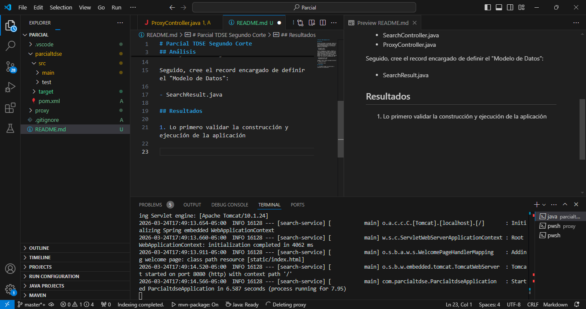

2. Ahora entramos desde el navegador

    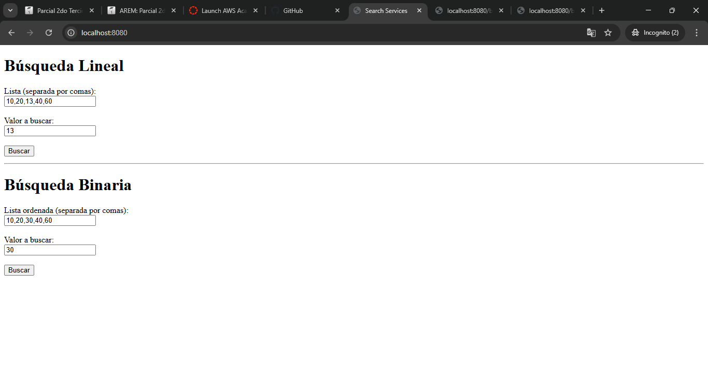

3. Validamos PROXY

    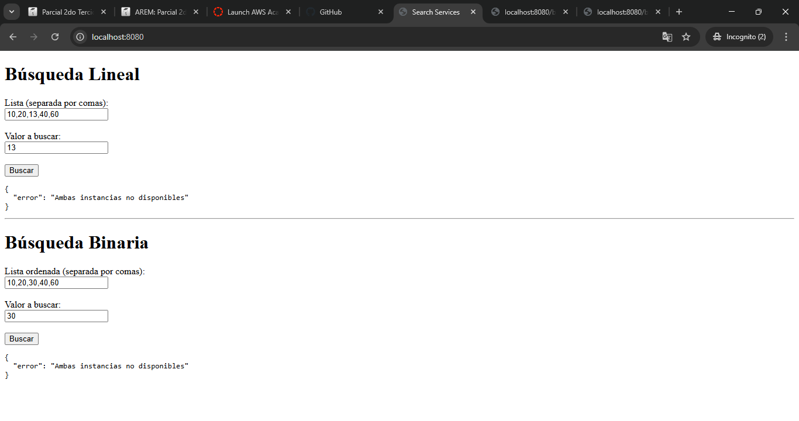

    Resultado esperado pues para este paso no hemos iniciado instancias

4. Validamos por URL

    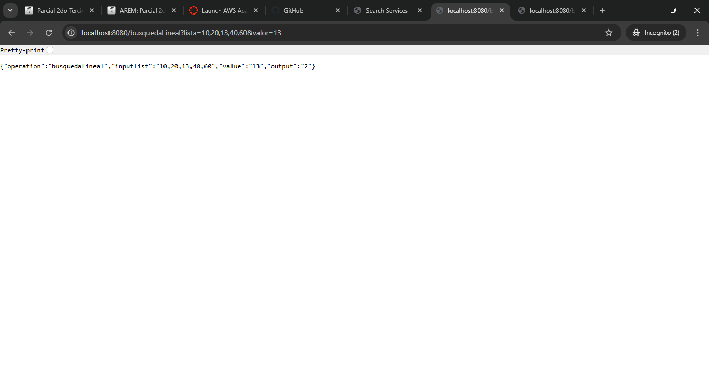
    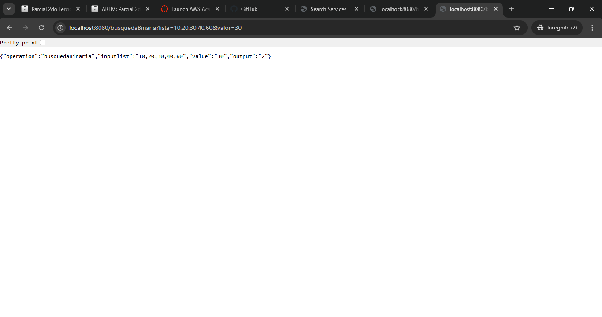
    En las imagenes se evidencia el resultado esperado para los parametros indicados, en el formato comentado en el enunciado.

## Configuración y Despliegue

1. Entramos AWS EC2 al apartado de instancias
    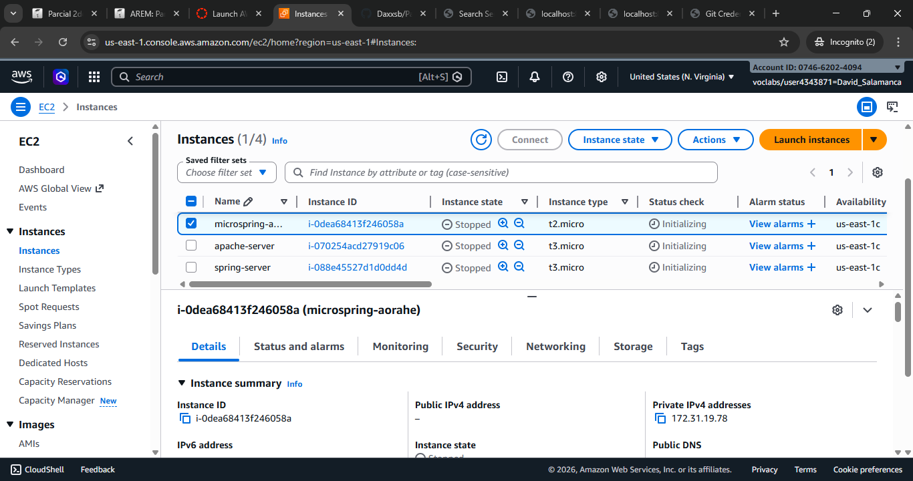

2. La idea principal es crear dos instancias para los servicios matemáticos y una para PROXY, esto de acuerdo a la arquitectura sugerida
    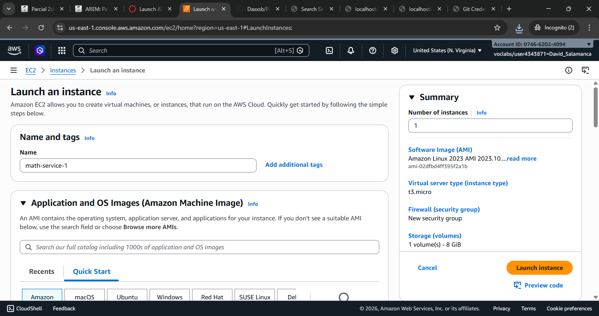
    Debemos crear un grupo de reglas de seguridad en donde habilitamos la conexión HTTP, con los parametros indicados en la imagen
    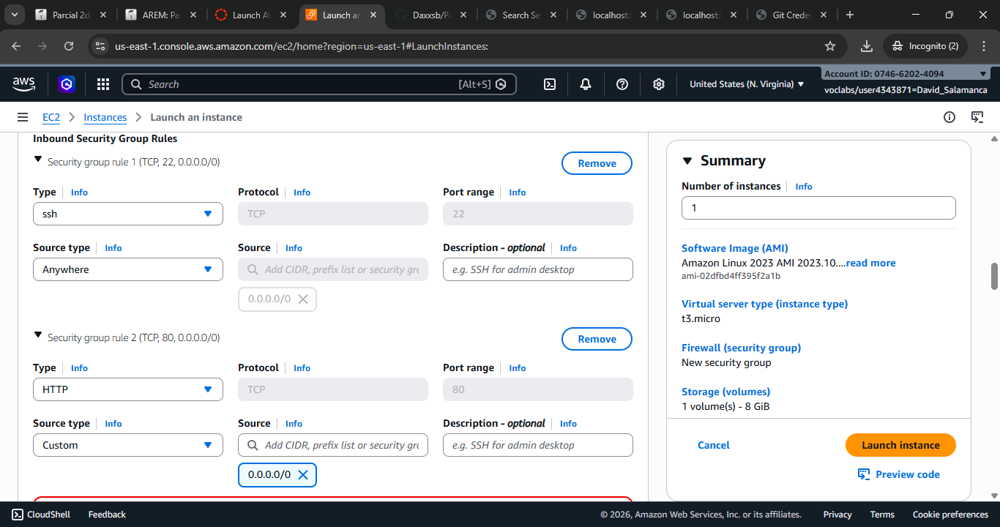
    Lanzamos la instancia
    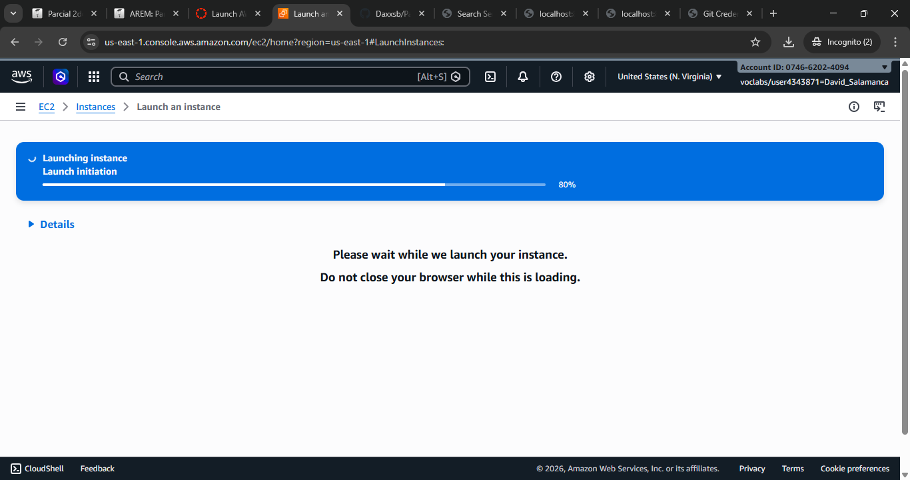
    Ahora nos conectamos por ssh y empezamos con la configuración de la instancia
    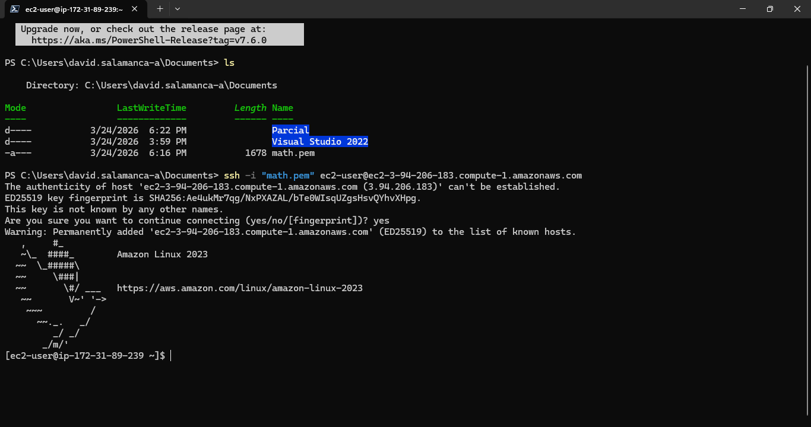
    Actualizamos e instalamos la versión trabajada de Java
    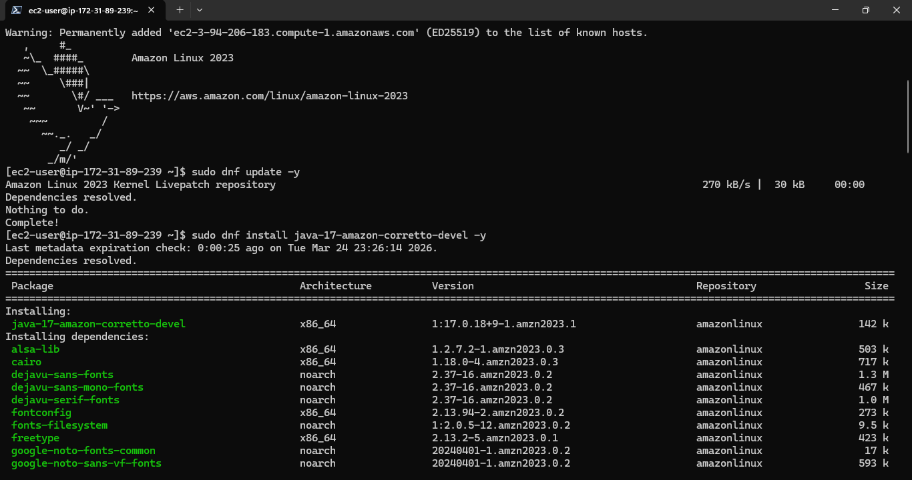
    
    Hacemos lo mismo con la otra instancia
    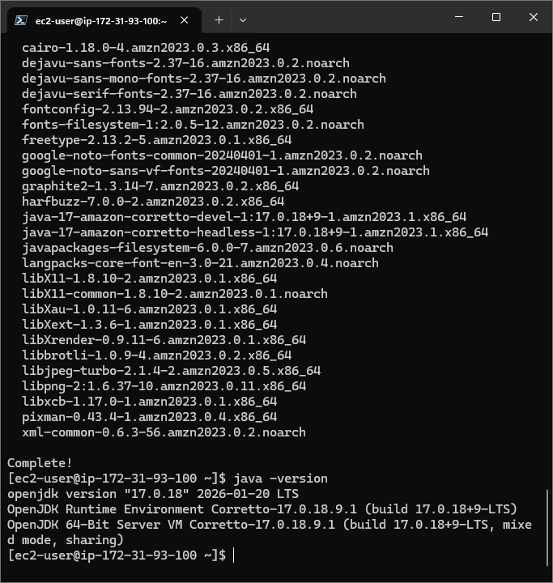
    Después cargamos el .jar en ambas instancias
    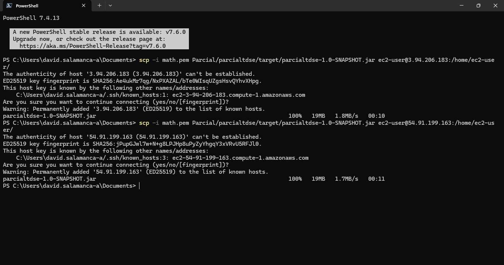
    Hacemos exactamente lo mismo con la tercera destinada al PROXY
    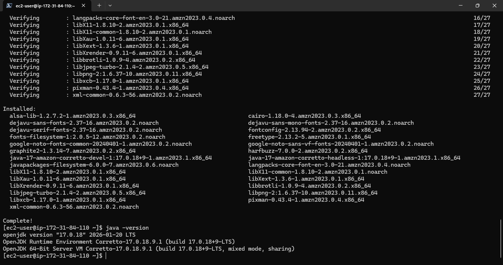

3. Validamos que las tres instancias esten corriendo
    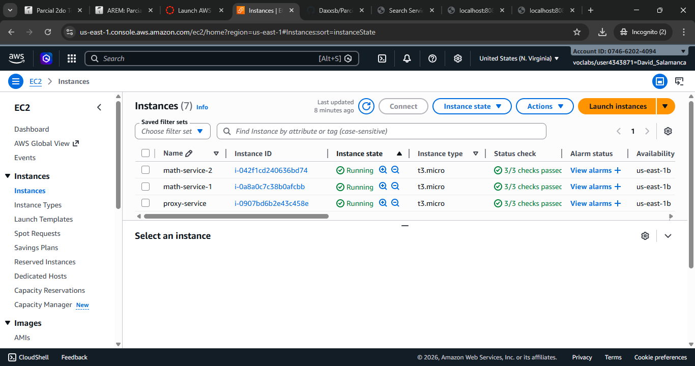